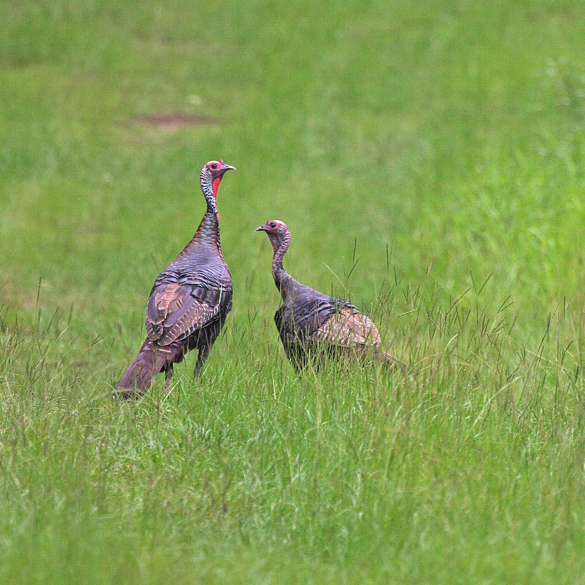
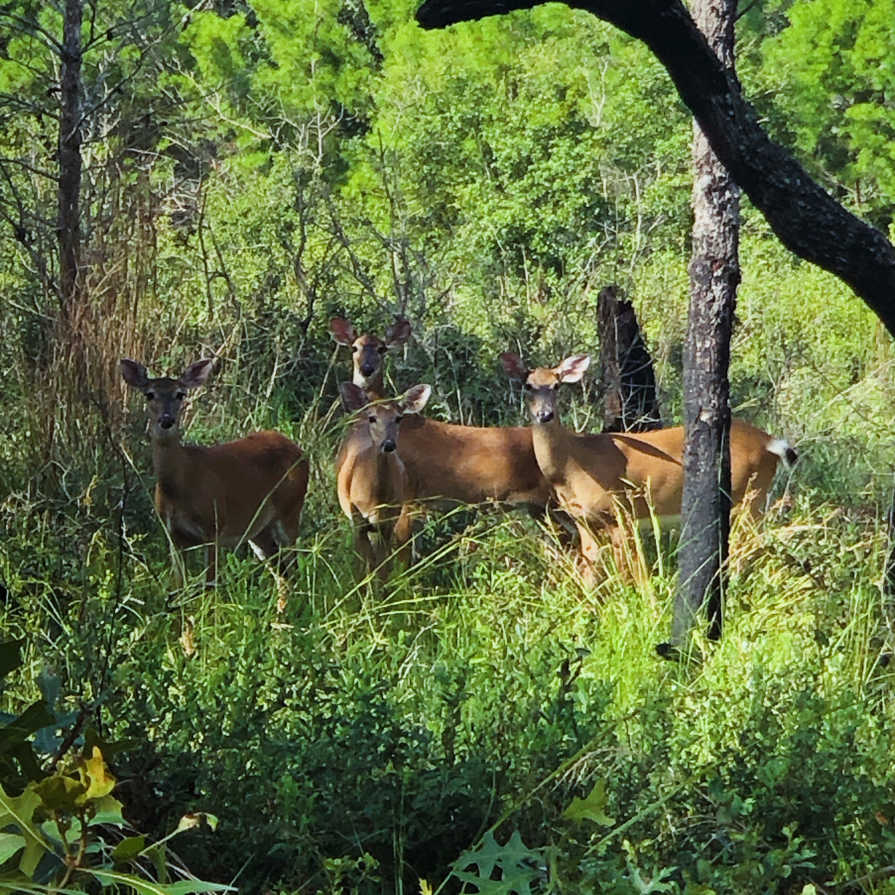
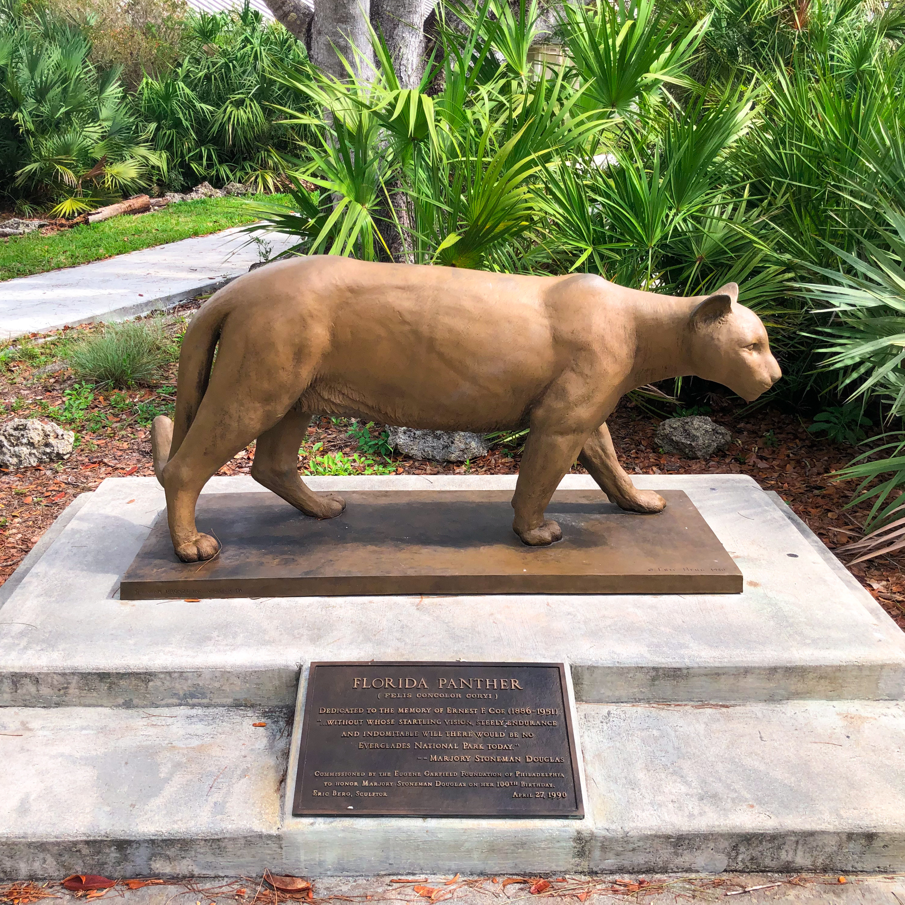
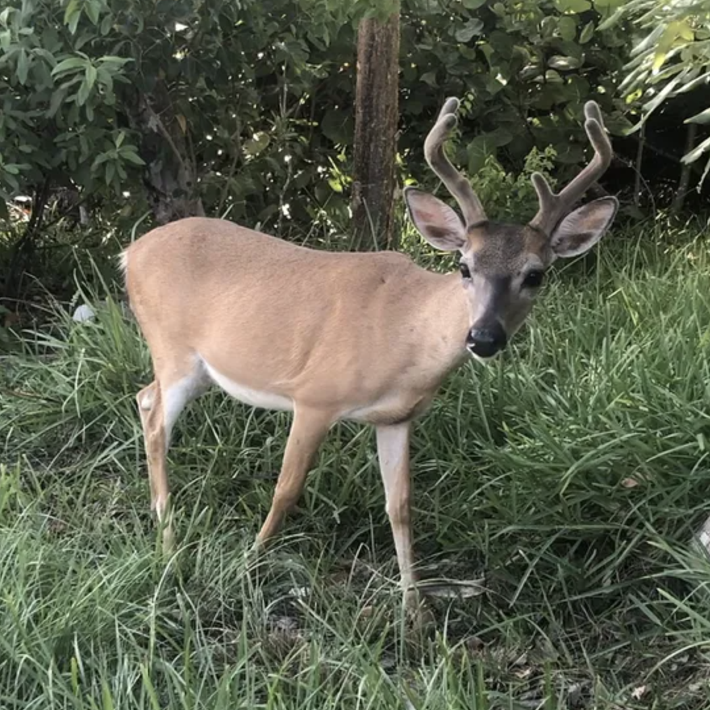
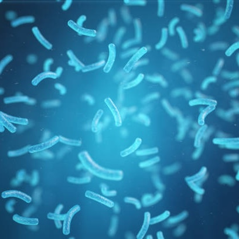
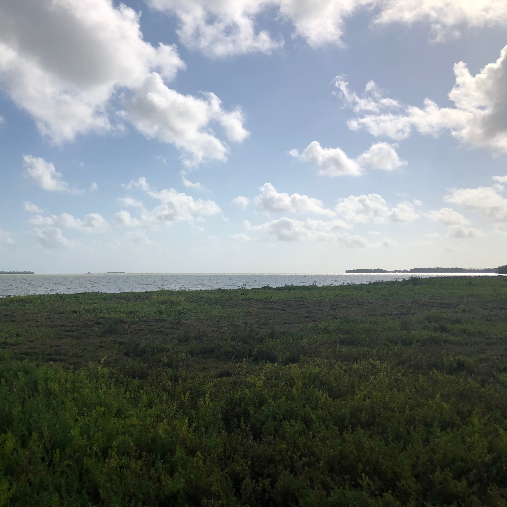
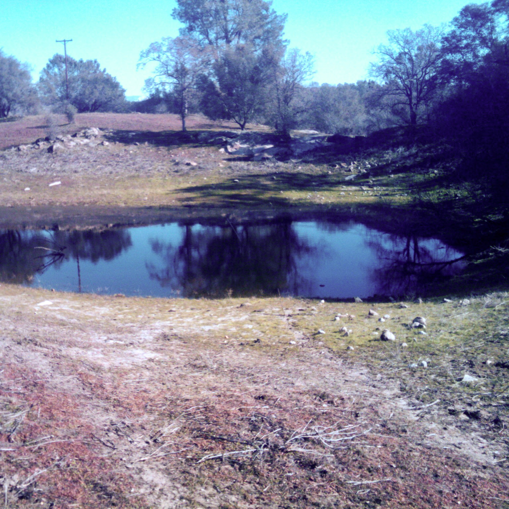
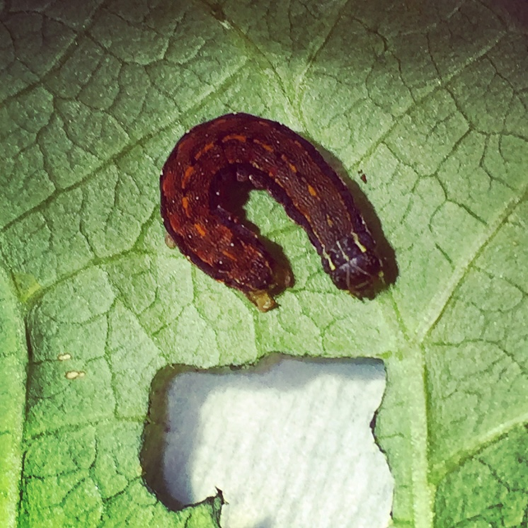

---
## Current Projects
---
### Effects of Climatic Variability on Resource Selection in Florida Turkeys

    
    

        

        Wild turkey populations in Florida experience substantial environmental variability across space and time. For this project, I am using GPS tracking data and dynamic resource selection models to evaluate how breeding status, seasonal conditions, and environmental variability influence habitat selection and space use. This study is a collaboration between the University of Central Florida and the University of Florida with the goal of better understanding of how wild turkeys respond to changing climatic conditions to inform management strategies that support suitable habitat throughout the breeding season (Image: FWC).
        

    

### Integrated Climate Change Vulnerability Assessment for White-tailed Deer

    
    

        

        White-tailed deer are central to the ecology of the Greater Everglades, yet their vulnerability to future climate change remains poorly understood. This project integrates ecological and whole-genome data to evaluate how suitable habitats may shift under future climate conditions and identify genetic variation that may contribute to adaptation. The study is in collaboration with the Florida Fish and Wildlife Conservation Commission and intended to help managers identify vulnerable populations and better understand the environmental and genetic factors that may influence the future persistence of white-tailed deer in South Florida. This project was funded by a grant I received from the Everglades Foundation and the Bass Pro Shops and Cabela's Outdoor Fund. A dissertation version of this work is <a href="https://stars.library.ucf.edu/gradstudies_etd_2026/216">available online</a>, though the manuscript has since been revised and adapted for journal review.
        

    

### Adaptive Variation Following Genetic Rescue in Florida Panthers

    
    

        

        Florida panthers underwent genetic rescue in the 1990s following a severe population bottleneck. However, the adaptive genomic variation present within the population is poorly understood. This project is focused on identifying genetic variants in Florida panthers potentially associated with current climatic conditions in order to better understand the ability of Florida panthers to respond to future climate change. DNA sequencing for this project was funded by a grant I recieved from the Everglades Foundation and the Bass Pro Shops and Cabela's Outdoor Fund. A dissertation version of this work is <a href="https://stars.library.ucf.edu/gradstudies_etd_2026/216">available online</a>, though the manuscript has since been revised and adapted for journal review.
        

    

### Signals of Urban Adaptation in the Evolution of Key Deer

    
    

        

        Urbanization has influenced evolutionary processes for many species on Earth. The affect of urbanization on species can be complex, with potentially beneficial, neutral, and harmful consequences. The Florida Key deer (<em>Odocoileus virgininaus clavium</em>) is an endemic subspecies of white-tailed deer found in the Florida Keys that has been geographically isolated for roughly 4000 years. Despite urbanization and disturbance on the Florida Keys, the Florida Key deer has persisted for decades. I am currently generating and analyzing whole genome sequencing data to investigate signals of adapation to urban environments in Key Deer that may be contributing to this persistence. A dissertation version of this work is <a href="https://stars.library.ucf.edu/gradstudies_etd_2026/216">available online</a>, though the manuscript has since been revised and adapted for journal review.
        

    

### The Effect of Urban Environments on Bacterial Diversity in White-tailed Deer

    
    

        

        Populations of species living in urban environments often show differences in bacterial diversity compared with their non-urban counterparts. These changes in the microbiome can have various physiological and behavioral consequences. This project, developed through a research-intensive genomics laboratory course I led at the University of Central Florida, examined differences in bacterial species diversity and richness between white-tailed deer harvested in urban and non-urban environments. A publication resulting from the course and project is currently under review.
        

    

---
## Previous Projects
---
### Influence of Landscape Barriers on Genetic Structure in Puma Concolor

    
    

        

        Vehicle collisions are one of the leading causes of mortality for many species of wildlife. Large mammals are especially vulnerable as large home range sizes may conflict with urban sprawl and the establishment of transportation infrastructure. As part of my disseration research, I explored how population genetic data could be used to help assess the extent to which anthropogenic and natural landscape barriers have influenced genetic structure and connectivity in Pumas (<em>Puma concolor</em>) from Arizona. This research has been published in <a href="https://doi.org/10.1016/j.biocon.2026.111877">Biological Conservation</a>. 
        

    

### Living Shoreline Suitability Meta-analysis

    
    

        

        Regional coastal studies across Florida were assessed to help identify where “living shorelines”, including natural features like marshes, mangroves, or oyster reefs, were most effective for coastal protection and restoration. Unlike grey infrastructure (e.g., seawalls or revetments), living shorelines reduce erosion while supporting wildlife and being more resilient to sea level rise. Because each regional study used different data and metrics, we developed a meta-analysis to combine them into a statewide model as part of a 2025 Florida Statewide Coastal Restoration Guide. This project was submitted to the Florida Department of Environmental Protection and is available through the <a href="https://stars.library.ucf.edu/ucfscholar/1342">University of Central Florida's STARS digital repository</a>. 
        

    

### Terrestrial Habitat Use by Western Pond Turtles

    
    

        

        We conducted a radiotelemetry study of Western Pond Turtles (<em>Actinemys marmorata</em>) in the Sierra Nevada foothills to assess seasonal patterns of movement and habitat use. The study focused on an intermittent pond system, with continuous monitoring across wet and dry seasons. We collected spatial location data, identified habitat features, and measured movement distances to evaluate the use of upland versus aquatic habitats over an annual cycle. This project was largely completed as a field technician in Dr. Brian Todd's lab at the University of California, Davis, and published in the <a href="http://www.jstor.org/stable/44164617">Journal of Herpetology</a>.
        

    

### Evaluating Microbial Biologics for Lepidopteran Pest Control in Crops

    
    

        

        I was previously employed by Bayer CropScience in West Sacramento, California, where I developed in-vitro, in-planta, and field experiments to evaluate the efficacy of microbial compounds (biologics) as alternatives to traditional chemical pesticides. I managed screening pipelines for early stage discovery, including methods to assess the effectiveness of novel compounds in controlling Lepidoptera on plants.
        

    

