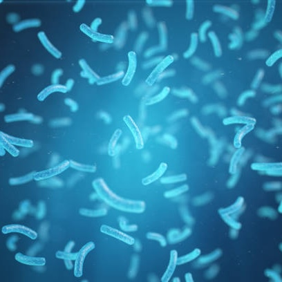

---
## Current Projects
---
### Landscape Genetics of Puma Concolor

    
    

        

        Vehicle collisions are consistently one of the leading causes of mortality for many species of wildlife. Large mammals are especially vulnerable as large home range sizes may conflict with urban sprawl and the establishment of transportation infrastructure. I am currently investigating how anthropogenic and evironmental landscape barriers have affected the population genetic structure of Pumas (<em>Puma concolor</em>) in Arizona, leveraging landscape genetic data and Bayesian ecological modeling to aid in identifying where wildlife corridors may be most effective.
        

    

### Comparative and Evolutionary Genomics

    
    

        

        Urbanization has influenced evolutionary processes for many species on Earth. The affect of urbanization on species can be complex, with potentially beneficial, neutral, and harmful consequences. The Florida Key deer (<em>Odocoileus virgininaus clavium</em>) is an endemic subspecies of white-tailed deer found in the Florida Keys that has been geographically isolated for roughly 4000 years. Despite large amounts of urbanization on the Florida Keys, the Florida Key deer has persisted and developed traits rarely found in their mainland relatives. I am currently generating whole genome sequencing data to explore the evolutionary processes underlying Key deer adaptation to urban evironments, and comparing these results to evolutionary processes found in other species that have also adapted to highly urbanized environments.
        

    

### Landscape Genomics of Terrestrial Vertebrates in the Greater Everglades 

    
    

        

        I am collaborating with the Florida Fish and Wildlife Conservation Commission to generate whole genome sequencing data for Florida panthers (<em>Puma concolor coryi</em>) and white-tailed deer (<em>Odocoileus virginianus</em>). Our focus is on understanding how they jointly interact with environments in south Florida and how this may contribute to their adaptive potential under changing climatic conditions. This project is funded by the Everglades Foundation and the Bass Pro Shops and Cabela's Outdoor Fund.
        

    

### The Effect of Urban Environments on Bacterial Diversity in White-tailed Deer

    
    

        

        Differences in bacterial diversity have been observed in populations of species living in urban environents compared to their non-urban counterparts. Examples of this include changes to the microbiome that occur as a result of changes to behavior, diet, and social interactions in urban environments. The project, in collaboration with a team of undergraduate researchers at the University of Central Florida, is focused on assessing differences in bacterial species diversity and richness between white-tailed deer harvested in urban and non-urban environments.
        

    

---
## Previous Projects
---

### Living Shoreline Suitability Meta-analysis

    
    

        

        Regional coastal studies across Florida were analyzed to help identify where “living shorelines”, including natural features like marshes, mangroves, or oyster reefs, were most effective for coastal protection and restoration. Unlike grey infrastructure (e.g., seawalls or revetments), living shorelines reduce erosion while supporting wildlife and being more resilient to sea level rise. Because each regional study used different data and metrics, we developed a meta-analysis to combine them into a statewide model. This work is being extended by collaborators, with the goal of facilitating the characterization of shoreline suitability across Florida, supporting long term coastal restoration planning. This project was submitted to the Florida Department of Environmental Protection.
        

    

### Evaluating Microbial Biologics for Lepidopteran Pest Control in Crops

    
    

        

        I was previously employed by Bayer CropScience in West Sacramento, California, where I developed in-vitro, in-planta, and field experiments to evaluate the efficacy of microbial compounds (biologics) as alternatives to traditional chemical pesticides. I managed screening pipelines for early stage discovery, including methods to assess the effectiveness of novel compounds in controlling Lepidoptera on plants.
        

    

### Terrestrial Habitat Use by Western Pond Turtles

    
    

        

        We conducted a radiotelemetry study of Western Pond Turtles (<em>Actinemys marmorata</em>) in the Sierra Nevada foothills to assess seasonal patterns of movement and habitat use. The study focused on an intermittent pond system, with continuous monitoring across wet and dry seasons. We collected spatial location data, identified habitat features, and measured movement distances to evaluate the use of upland versus aquatic habitats over an annual cycle. This project was largely completed as a field technician in Dr. Brian Todd's lab at the University of California, Davis.
        

    

